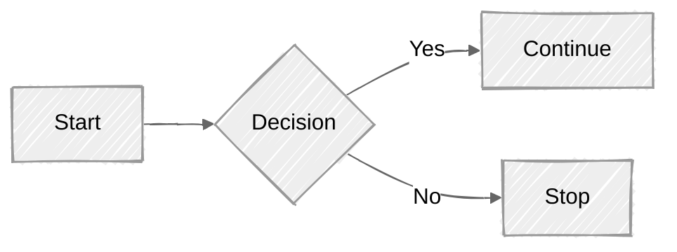

# Archive

Install using Julia's package manager:
```julia
using Pkg
Pkg.add("YourProject")
```

## Example.jl Documentation

```@docs
```

This is the binomial coefficient.

---

To write a system of equations, use the `aligned` environment:

```math
\begin{aligned}
\nabla\cdot\mathbf{E}  &= 4 \pi \rho \\
\nabla\cdot\mathbf{B}  &= 0 \\
\nabla\times\mathbf{E} &= - \frac{1}{c} x_{Pin} \frac{\partial\mathbf{B}}{\partial t} \\
\nabla\times\mathbf{B} &= - \frac{1}{c} \left(4 \pi \mathbf{J} + \frac{\partial\mathbf{E}}{\partial t} \right)
\end{aligned}
```

These are Maxwell's equations.


